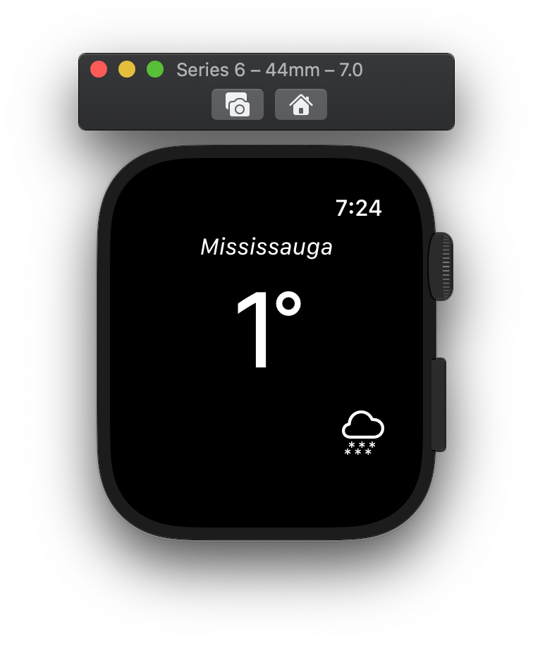

# WeatheApp-iOS-WatchOS

## What does this app do? 
 - It fetches data from open weather map website and using JSON decoder to map out the data passed by calling API.
 - Watch app is connected to iPhone app. So, when ever user enters city name data will be changed in both iPhone and watch.
 
## Technologies / Libraries used to create this project
 - https://openweathermap.org to get weather info by API calls
 - JSONParsing
 - Watch connectivity sessions
 
 ## Demo of app
  
 
 
